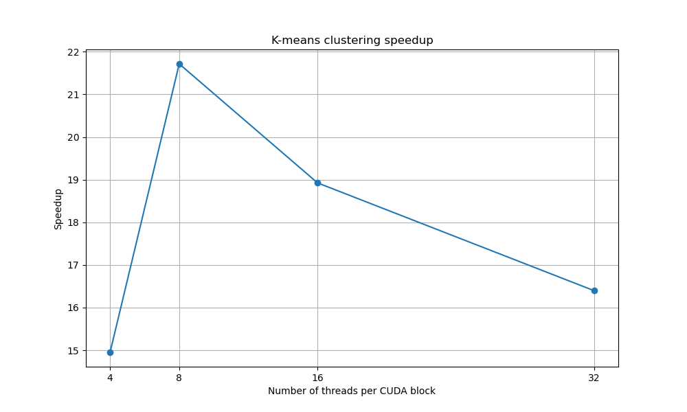

# K-means Clustering with CUDA Parallelization


## Algorithm and Parallelization Method

In this work K-means was used as a subject for parallelization.  
Sequential K-means was implemented from scratch with numpy library.  
Parallized version of K-means was implented with CUDA and numba library. In order to leverage parallelization custom CUDA kernels were implemented with use of numba.cuda.  

### How to run:
1. Clone the repository:
```
git clone https://github.com/dxrsgn/PAforASD2024.git
cd PAforASD2024
```
2. Install cuda toolkit  
3. Set up enviroment:  
```
pip install -r requirements.txt
```
4. Run the benchmark: 
```
./experiment.sh
```
Troubleshooting:  
```
numba.cuda.cudadrv.driver.CudaAPIError: [100] Call to cuInit results in CUDA_ERROR_NO_DEVICE
```
Such exception can occur because numba can't find CUDA lib, so set up your LD_LIBRARY_PATH and NUMBA_CUDA_DRIVER to CUDA paths, e.g.:
```
export LD_LIBRARY_PATH="/usr/lib/wsl/lib/"
export NUMBA_CUDA_DRIVER="/usr/lib/wsl/lib/libcuda.so.1"
```

## Data
Data is automatically generated on behchmark run using sklearn.datasets.make_blobs with specified random seed.  
Totaly there are 70000 samples, 50 features and 5 clusters.

## Parallelized parts
Specifically, following parts were parallelized:  
- Calculation of distance between data and centroids. Custom CUDA 2d kernel was implemented to solve this task. First dimension of kernel was assigned to data points and second to cluster, thus in parallel by CUDA were calculated distances between each data point and each centroids  
- Label assingment. Custom 1d kernel was implemented to find argmin on distances vector.  
- Centroids summation. Custom 1d kernel was implemented to find sum of data points assigned to specific kernel. Parallelization was made on data points dimension with use of atomic operations. Thus, in parallel each data point added to global vector of centroids its values. To prevent racing, atomic operations were used. This part could be further improved with shared arrays and block summation techniques, since using atomic operations slows down computations because of blocking clusters.   
## Speedup graph

In the experiment number of threads means number of threads per CUDA block.  For 1d kernels (argmin, cluster sum) there are executed totaly ```n_blocks*n_threads``` threads (number of blocks is automatically calculated to fit all the data).  
For 2d kernel (distance calculation) there are executed totaly ```n_blocks_x*n_threads + n_blocks_y*n_threads``` threads.  
In the plot belove number of threads mean n_threads value.  



